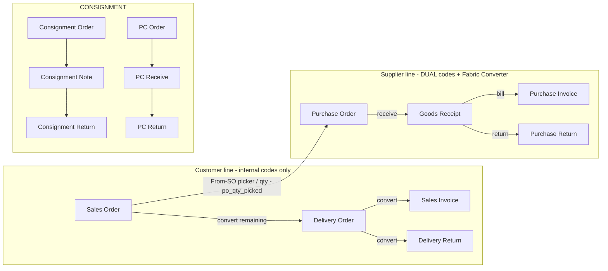
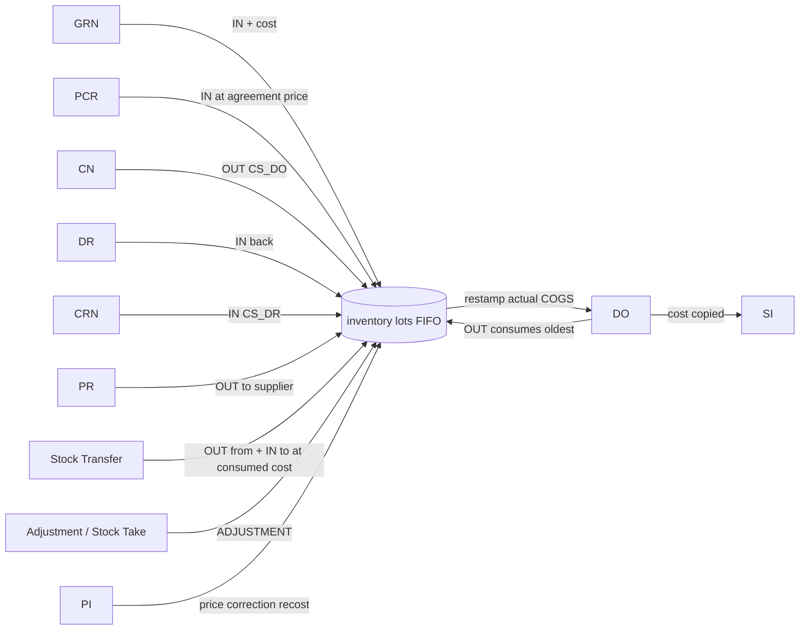
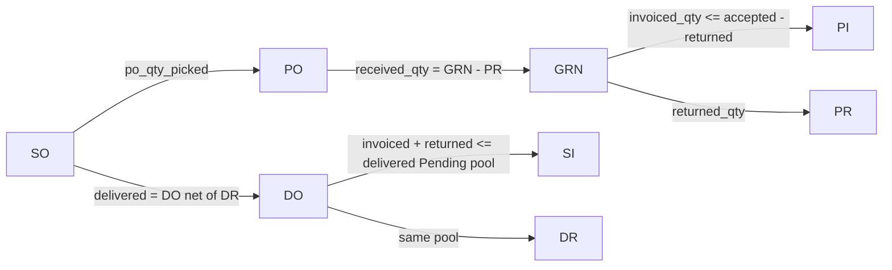

# Supply-Chain Document System

Canonical documentation of every supply-chain document in 2990s: what each one is for,
who sees it, which code vocabulary it prints, where its print template lives, and the
lifecycle/locking rules that protect it. Factual to this codebase — file paths cited
throughout. Last verified 2026-06-11.

---

> **2026-06-11 update — dual-code printing now LIVE on the whole purchasing line:** PO / GRN / PI / PR PDFs all print Supplier Code + Our Code columns; fabric colours print as the supplier's colour code with our code in brackets (Fabric Converter `fabric_trackings.supplier_code`). PI/PR have no stored `supplier_sku` column — resolved at print time from the supplier's main bindings. Lookups fail-soft (a mapping error never blocks the PDF). Helper: `apps/backend/src/lib/supplier-doc-data.ts`. Customer-line docs (SO/DO/SI/DR + POS) remain internal-only by rule.

## 0. Operator cheat-sheet

| Doc | Full name | Who sees the print | Codes printed | Print template (`apps/backend/src/lib/`) |
|-----|-----------|--------------------|---------------|------------------------------------------|
| SO  | Sales Order | Customer | OUR item codes only | `sales-order-pdf.ts` |
| DO  | Delivery Order | Customer (signed POD) | OUR item codes only | `delivery-order-pdf.ts` |
| SI  | Sales Invoice | Customer | OUR item codes only | `sales-invoice-pdf.ts` |
| DR  | Delivery Return | Customer (signs on collection) | OUR item codes only | `delivery-return-pdf.ts` |
| PO  | Purchase Order | Supplier | SUPPLIER SKU on lines (falls back to our code if unbound) | `purchase-order-pdf.ts` |
| GRN | Goods Receipt Note | Internal + supplier reconciliation | OUR material codes | `grn-pdf.ts` |
| PI  | Purchase Invoice | Internal filing copy | OUR material codes | `purchase-invoice-pdf.ts` |
| PR  | Purchase Return | Supplier (credit-note request) | OUR material codes | `purchase-return-pdf.ts` |
| CO  | Consignment Order | Consignee (customer-side) | OUR item codes | reuses `sales-order-pdf.ts` |
| CN  | Consignment Note | Consignee | OUR item codes | reuses `delivery-order-pdf.ts` |
| CRN | Consignment Return | Consignee | OUR item codes | reuses `delivery-return-pdf.ts` |
| PCO | Purchase Consignment Order | Supplier | SUPPLIER SKU (via PO template) | reuses `purchase-order-pdf.ts` |
| PC-Recv | Purchase Consignment Receive | Internal | OUR material codes | reuses `grn-pdf.ts` |
| PC-Ret | Purchase Consignment Return | Supplier | OUR material codes | reuses `purchase-return-pdf.ts` |
| ST  | Stock Transfer | Internal only | OUR codes | no PDF template |
| ADJ | Stock Adjustment | Internal only | OUR codes | no PDF template |
| TAKE | Stock Take | Internal only | OUR codes | no PDF template |

**Owner rule:** every CUSTOMER-facing document (SO / DO / SI / DR and their consignment
twins) shows ONLY our internal data — no `supplier_sku`, no supplier colour code,
anywhere. The ONLY printed document that speaks the supplier's vocabulary is the
Purchase Order (and PCO, which shares its template).

---

## 1. Document map

### 1.1 Customer line — SO → DO → SI → DR

All four templates share the `pdf-common.ts` structure: `drawHeader` (company block +
doc title + right-aligned No/Date/Status meta) → `drawTwoColInfo` (parties block) →
jspdf-autotable striped lines table (8.5pt, dark header) → totals →
`drawSignatureBoxes` (two dashed boxes) → footer terms + `Generated <stamp>` line.
Dates via `fmtDocDate` (`2026/05/31`), money via `fmtRm`.

| Doc | Purpose | Key data columns on the print | Extra blocks |
|-----|---------|-------------------------------|--------------|
| **SO** (`sales-order-pdf.ts`, route `apps/api/src/routes/mfg-sales-orders.ts`) | The order contract with the customer | # / Item / Description / Group / Qty / Unit / Disc / Total; per-category totals (Mattress-Sofa, Bedframe, Accessories, Others, Services) + grand total | **Payments ledger** table (Date · Method · Amount · Approval Code · Collected By) from `mfg_sales_order_payments`, with Subtotal · Paid · Balance summary + expected-deposit line; PWP voucher notes; sofa builds folded to ONE Model row (`groupSoLinesForDisplay`, `@2990s/shared/so-line-display`) |
| **DO** (`delivery-order-pdf.ts`, route `delivery-orders-mfg.ts`) | Signed proof-of-delivery; moves stock OUT | # / Item / Description / Qty / m³ / Unit Price | **Driver / Vehicle / Expected / Volume** logistics block (right column of the parties block); customer + driver signature boxes |
| **SI** (`sales-invoice-pdf.ts`, route `sales-invoices.ts`) | Bill the customer for delivered goods; posts revenue JE | # / Item / Description / Qty / Unit Price / Disc / Total; Subtotal / Discount / Tax / Grand Total / Paid / Outstanding | Due-date + SO Ref in header meta |
| **DR** (`delivery-return-pdf.ts`, route `delivery-returns.ts`) | Customer returns goods; stock back IN, SO re-opens | # / Item / Description / Qty / Condition / Unit Price / Refund; TOTAL REFUND | Reason block; customer-confirms-return signature |

Variant display on the SO print is sanitised by `VARIANT_KEYS_HIDDEN`
(`sales-order-pdf.ts`) — machine keys (buildKey/cells/PWP/extraAddonAmountRM etc.)
never reach the customer. The variant values that DO print (e.g. `fabricCode:
CG-002`) are OUR fabric codes from `fabric_trackings.fabric_code`, never the
supplier's.

### 1.2 Supplier line — SO → PO → GRN → PI → PR

| Doc | Purpose | Code vocabulary | Key data columns |
|-----|---------|-----------------|------------------|
| **PO** (`purchase-order-pdf.ts`, route `mfg-purchase-orders.ts`) | Order goods from the supplier. AutoCount-style layout (PR #102): centered company bar, boxed supplier + meta blocks, plain-ruled table | **DUAL** (2026-06-11): printed table = Supplier Code (bold, first) + Our Code side by side; `supplier_sku` from the line snapshot, fallback to the live main binding, else —. Fabric in Specs prints as supplierColour (ourCode) via Fabric Converter (`supplier-doc-data.ts`) | # / Item+Description / Transferred SO / UOM / Qty / U-Price / Disc / Total; Terms, Delivery Date, Purchase Location, S/O No. |
| **GRN** (`grn-pdf.ts`, route `grns.ts`) | Record goods received against a PO; stock IN at PO cost, dye-lot `batch_no` = source PO number | OUR codes | # / Code / Description / Recv / Acc / Rej / Reason / Unit Price; DN Ref + PO Ref |
| **PI** (`purchase-invoice-pdf.ts`, route `purchase-invoices.ts`) | Register the supplier's bill; posts Dr 1200 / Cr 2000 JE | OUR codes (supplier's own invoice no. shown as "Supplier Ref") | # / Code / Description / Qty / Unit Price / Total; Subtotal / Tax / Grand Total / Paid / Outstanding |
| **PR** (`purchase-return-pdf.ts`, route `purchase-returns.ts`) | Send goods back to the supplier, request credit note | OUR codes | # / Code / Description / Qty / Unit Price / Refund / Reason; PO Ref + GRN Ref + Supplier CN |

### 1.3 Consignment documents

Consignment reuses the four customer/supplier generators with `opts.docTitle` /
`docNoLabel` overrides — there are no separate consignment templates.

| Doc | Route | Print reuse (caller) |
|-----|-------|----------------------|
| **CO** Consignment Order | `apps/api/src/routes/consignment-orders.ts` | `generateSalesOrderPdf(…, { docTitle: 'CONSIGNMENT ORDER', docNoLabel: 'CO No' })` — `ConsignmentOrderDetail.tsx:462`, `ConsignmentOrders.tsx:954`. No payments ledger passed (consignment has no payments). |
| **CN** Consignment Note | `consignment-notes.ts` | `generateDeliveryOrderPdf(…, { docTitle: 'CONSIGNMENT NOTE', docNoLabel: 'CN No' })` — `ConsignmentNoteDetail.tsx:314` |
| **CRN** Consignment Return | `consignment-returns.ts` | `generateDeliveryReturnPdf(…, { docTitle: 'CONSIGNMENT RETURN', docNoLabel: 'CR No', amountLabel: 'Value', totalLabel: 'TOTAL VALUE' })` — `ConsignmentReturnDetail.tsx:324` (no refund money — prints goods VALUE) |
| **PCO** Purchase Consignment Order | `purchase-consignment-orders.ts` | `generatePurchaseOrderPdf(…, { docTitle: 'PURCHASE CONSIGNMENT ORDER' })` — `PurchaseConsignmentOrderDetail.tsx:194` |
| **PC-Receive** | `purchase-consignment-receives.ts` | `generateGrnPdf(…, { docTitle: 'CONSIGNMENT RECEIVE', docNoLabel: 'Receive No' })` — `PurchaseConsignmentReceiveDetail.tsx:196` |
| **PC-Return** | `purchase-consignment-returns.ts` | `generatePurchaseReturnPdf(…, { docTitle: 'PURCHASE CONSIGNMENT RETURN', docNoLabel: 'Return No', amountLabel: 'Value', totalLabel: 'TOTAL VALUE' })` — `PurchaseConsignmentReturnDetail.tsx:172` |

Because CO/CN/CRN ride the customer templates, they automatically inherit the
internal-codes-only rule.

### 1.4 Internal stock documents (no print templates)

| Doc | Route | Notes |
|-----|-------|-------|
| **Stock Transfer** | `apps/api/src/routes/stock-transfers.ts` | Posts immediately (DRAFT removed in migration 0078; submit button reads "Post Transfer"). OUT of source + IN to destination, carrying `batch_no` + FIFO cost (cost re-queried post-insert — BUG-2026-06-11-001 #C-1). Cancel reverses via `reverseMovements`. |
| **Stock Adjustment** | `inventory.ts` `POST /adjustments` (line 639) | Single ADJUSTMENT movement; +qty creates a batched lot, −qty consumes FIFO; re-walks SO allocation afterwards (BUG-2026-06-11-001 #12). |
| **Stock Take** | `stock-takes.ts` | Count sheet → post variance as ADJUSTMENT; `cancel` / `reverse` / `post` endpoints. KNOWN OPEN: variant-blind, posts variance to the empty-variant bucket (BUG-2026-06-03-004 in `docs/BUG-HISTORY.md`). |

---

## 2. Code-translation rules

There are exactly TWO our-code → supplier-code mechanisms. Nothing else translates
codes, and nothing translates on the customer side.

### 2.1 SKU binding (`supplier_material_bindings.supplier_sku`)

- **What:** per-(supplier × SKU) row binding our `material_code` to the supplier's
  own SKU. Composed client-side as `base + '-' + suffix` by `composeSupplierSku` /
  `suffixForSku` in `apps/backend/src/lib/supplier-sku-helpers.ts`:
  sofa → compartment suffix (`5539-1A(LHF)`), bedframe/mattress → `size_code`
  (`5539-K`), accessory/service → bare base code. The server persists whatever the
  client computed (`/bindings/batch`).
- **When it applies:** ONLY when printing a PO/PCO. `purchase-order-pdf.ts` line ~197:
  `const supplierFacingCode = it.supplier_sku?.trim() || it.material_code;` — the UI
  grid keeps showing our code; only the printed/emailed PO swaps vocabulary.
- **Where the value gets onto the PO line:** PO creation paths copy
  `supplier_sku` from the effective binding (`apps/api/src/routes/mfg-purchase-orders.ts`,
  e.g. the convert-from-SO path and the append path around line 1696). Unbound
  free-text lines keep `supplier_sku = null` → the print falls back to our code.
- **Pricing side-effect:** the same binding row carries `price_matrix` (P1/P2 cells by
  fabric tier) used by `computeMfgPoUnitCost` to cost PO lines — but that is pricing,
  not code display.

### 2.2 Fabric Converter (`fabric_trackings.fabric_code` ↔ `supplier_code`)

- **What:** the Fabric Converter page (`apps/backend/src/pages/FabricTracking.tsx`,
  renamed from "Fabric Tracking" 2026-05-26) maintains procurement fabric rows. Each
  row maps OUR colour code (`fabric_code`, e.g. `CG-002`) to the supplier's own colour
  code (`supplier_code`, nullable; migration `0046_fabric_supplier_code.sql`). Inline
  edit via `PATCH /fabric-tracking/:id/supplier-code`
  (`apps/api/src/routes/fabric-tracking.ts:302`).
- **When it applies:** as an operator LOOKUP when communicating fabric colours to the
  supplier. It is currently NOT auto-substituted into any printed document — PO PDFs
  print the line's `supplier_sku`; fabric colour variants on order lines stay in OUR
  `fabricCode` vocabulary everywhere. (`fabric_trackings` is read by the PO cost
  engine only for `price_tier`/`sofa_price_tier`/`bedframe_price_tier`.)
- **Selling-side mirror:** `fabric_colours.colour_id == fabric_trackings.fabric_code`
  (kept in sync by `syncFabricToSellingLibrary` in the fabric-tracking route) feeds
  the POS/SO fabric pickers — again OUR codes only.

### 2.3 What customers see

Customer documents (SO/DO/SI/DR + CO/CN/CRN) print `item_code` / `description`
straight from the order-line snapshot — our internal vocabulary. Verified 2026-06-11:
none of the four customer generators reference `supplier_sku` or
`fabric_trackings.supplier_code`, and `VARIANT_KEYS_HIDDEN` strips machine/PWP/money
keys from the variants summary.

---

## 3. Lifecycle, status and locking rules

Summarised from `docs/BUG-HISTORY.md` (2026-06-01 → 2026-06-11 entries); each rule is
enforced server-side in the cited route.

### 3.1 Cancelled = FINAL

| Doc | Rule | Where |
|-----|------|-------|
| DO | CANCELLED → any reactivation = 409 `do_cancelled_final`. Re-deliver via a NEW DO. (Reactivation used to double-add stock.) | `delivery-orders-mfg.ts` status PATCH (BUG-2026-06-11-001 #1) |
| DR | CANCELLED is final = 409 `dr_cancelled_final`. | `delivery-returns.ts` (BUG-2026-06-11-001 #3) |
| SO | CANCELLED is final; deposit credit no longer double-counts. | `mfg-sales-orders.ts` (BUG-2026-06-11-002 batch 2, commit f50c0e3) |
| SI | Payments blocked on CANCELLED; line CRUD 409 `invoice_cancelled`; reopen-to-SENT re-runs `checkSiOverRemaining` (409 `over_remaining`) and re-posts revenue + reverses the cancel credit. | `sales-invoices.ts`, `post-si-revenue.ts` (BUG-2026-06-03-003, BUG-2026-06-11-001 #13) |
| GRN | Line add/edit/delete blocked on CANCELLED/CLOSED (ghost-stock door). | `grns.ts` line routes (BUG-2026-06-11-001 #10) |
| CRN | Line CRUD locked on REFUNDED / CREDIT_NOTED / CANCELLED (`returnLineLock`). | `consignment-returns.ts` (BUG-2026-06-07-002 #3) |
| PC-Return | Same lock (`pcReturnLineLock`); over-return = 409 `qty_exceeds_remaining` on ALL paths incl. bare create (reject, never clamp). | `purchase-consignment-returns.ts` (BUG-2026-06-07-002 #4) |

### 3.2 Child locks (upstream header frozen once a child exists)

- SO header PATCH locked once a PO / DO / SI child exists; DO header PATCH locked once
  an SI / DR child exists (`mfg-sales-orders.ts` / `delivery-orders-mfg.ts`).
- Exception class: an elapsed-but-unchanged past Processing Date is grandfathered —
  only a genuinely NEW past date is rejected (BUG-2026-06-01-003).

### 3.3 Over-receipt / over-invoice / over-return caps

- **GRN over-receipt:** received qty per PO line capped; enforced on manual create,
  add-line AND the bulk `/from-pos` / `/from-po-items` paths with post-insert
  verify-and-rollback (race-safe). `recomputePoReceived` subtracts purchase returns.
- **PI over-invoice:** invoiceable = accepted − returned; same post-insert verify on
  bulk paths (BUG-2026-06-03-007 #8/#9).
- **DR over-return:** `checkDrOverRemaining` on create, bulk `/from-do` AND line edit —
  cannot return more than net delivered (BUG-2026-06-07-001 #2).
- **Counters are recounted, never delta-adjusted:** `received_qty` / `invoiced_qty` /
  `returned_qty` / `po_qty_picked` all recount from live child rows (self-healing;
  BUG-2026-06-03-006).

### 3.4 Status sync across the chain

- DO/DR mutations re-derive the SO's delivered state from NET qty (Σ DO − Σ DR):
  full return re-opens DELIVERED → READY_TO_SHIP (`so-delivery-sync.ts`,
  BUG-2026-06-01-007/-009).
- Converts only take the unpicked/undelivered remainder (PO convert-from-SO fixed
  2026-06-11 — no more double-ordering, and PO lines price from the supplier binding
  matrix, never the SO selling price).
- Sofa lines ship only when ONE dye-lot batch covers the whole set
  (`sofa-set-coverage.ts` / `sofa-batch-guard.ts`).

## Document Relationship Map (2026-06-11)

> Live per-document graphs: every detail page's **Relationship Map** button (document-flow engine) renders the real links of that specific document. The diagrams below are the SYSTEM-level map.

### Main flows

### Stock & cost (FIFO)

### Quantity ledgers (what each link counts)

### Code translation points
- **SKU binding** (`supplier_material_bindings.supplier_sku`): applied on PO/GRN at write time (snapshot), PI/PR at print time. Never on customer-line docs.
- **Fabric Converter** (`fabric_trackings.fabric_code -> supplier_code`): applied at print time on all four purchasing PDFs as `supplierColour (ourCode)`.
