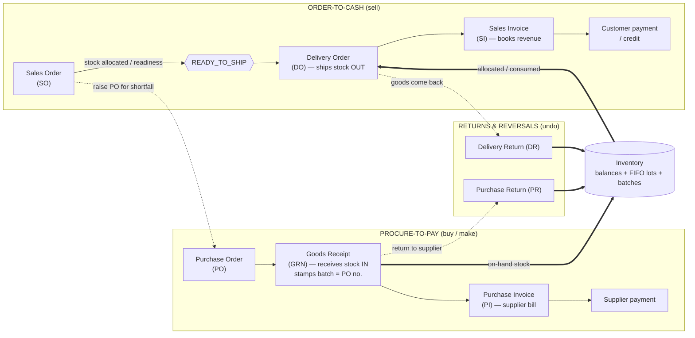

# 2990s ERP — Standard Operating Procedures (Master Overview)

**Owner:** Management · **Audience:** All operators, finance, management, auditors · **Language:** English (the product UI is English-only) · **Status:** Living document — keep in sync with the system.

This is the master index and operating standard for the 2990s manufacturing ERP. It defines **how every business document flows from order to invoice**, who is responsible at each step, and the controls the system enforces. Each value stream has its own detailed SOP (see [Document set](#7-document-set)).

> **How to read this.** Section 2 is the one-page map of the whole business. Sections 3–6 are the register, roles, principles and numbering that ALL the SOPs share. Section 7 links the per-process SOPs. Section 8 is the glossary.

---

## 1. Purpose & Scope

To provide a single, authoritative, enterprise-standard description of the order-to-cash and procure-to-pay processes as implemented in this ERP, so that:

- every operator performs each step the same way, every time;
- finance can rely on the books being correct (revenue, COGS, inventory valuation, AR/AP);
- management and external auditors can verify the controls;
- the system's enforced rules and the human procedures are documented together (no gap between "what the system does" and "what staff must do").

**In scope:** Sales Orders, Purchase Orders, Goods Receipts, Delivery Orders, Sales & Purchase Invoices, Delivery & Purchase Returns, Inventory (movements, FIFO costing, batches, stock-takes, transfers, adjustments), customer credits, and the accounting entries these generate.

**Out of scope:** payroll, fixed assets, tax filing, and HR. (The system records the General Ledger entries for the documents above; statutory reporting is performed outside the system.)

---

## 2. The Business at a Glance — End-to-End Workflow

The business runs **two value streams** that meet at the warehouse (inventory), plus two supporting flows (returns and inventory housekeeping).

**Plain-language flow (the happy path):**

1. **Sell:** A customer order is captured as a **Sales Order (SO)**. The system checks stock and marks each line READY or PENDING.
2. **Buy/make what's short:** For lines without stock, raise a **Purchase Order (PO)** to a supplier (one supplier per PO). Sofa sets are bought as one PO = one dye-lot **batch**.
3. **Receive:** When goods arrive, a **Goods Receipt (GRN)** brings them into inventory and tags each lot with its batch (the PO number).
4. **Ship:** Once an SO's lines are READY, a **Delivery Order (DO)** ships the stock out (deducts inventory). Sofa sets must ship **complete, from one batch**.
5. **Bill:** A **Sales Invoice (SI)** is issued for what was delivered — this **books the revenue** to the General Ledger.
6. **Pay:** The customer pays; payments are recorded against the SI. Supplier bills (**Purchase Invoices, PI**) are 3-way matched (PO ↔ GRN ↔ PI) and paid.
7. **Undo when needed:** Goods coming back use a **Delivery Return (DR)**; goods sent back to a supplier use a **Purchase Return (PR)**. Cancellations fully reverse stock, cost, status and the ledger.

---

## 3. Document Register

| Document | Code prefix | Creates | Inventory effect | Ledger effect | Statuses |
|---|---|---|---|---|---|
| **Sales Order (SO)** | `SO-YYMM-NNN` | Customer demand | none (reserves/allocates) | none | CONFIRMED → READY_TO_SHIP → (SHIPPED/INVOICED) · CANCELLED |
| **Purchase Order (PO)** | `PO-YYMM-NNN` | Supplier demand | none | none | SUBMITTED → PARTIALLY_RECEIVED → RECEIVED · CANCELLED |
| **Goods Receipt (GRN)** | `GRN-YYMM-NNN` | Receives goods | **IN** (+ creates FIFO lot, stamps batch) | none (cost basis only) | POSTED · CANCELLED |
| **Purchase Invoice (PI)** | `PI-YYMM-NNN` | Supplier bill | none (sets real cost via recost) | AP / expense | POSTED → PARTIALLY_PAID → PAID · CANCELLED |
| **Delivery Order (DO)** | `DO-YYMM-NNN` | Ships to customer | **OUT** (consumes FIFO/batch) | COGS (via cost) | DISPATCHED · CANCELLED |
| **Sales Invoice (SI)** | `SI-YYMM-NNN` | Bills customer | none | **Dr AR / Cr Revenue** (on issue) | SENT → PARTIALLY_PAID → PAID/OVERDUE · CANCELLED |
| **Delivery Return (DR)** | `DRT-YYMM-NNN` | Customer returns | **IN** (reverses the DO OUT) | reverses COGS | POSTED · CANCELLED |
| **Purchase Return (PR)** | `PRT-YYMM-NNN` | Return to supplier | **OUT** (reverses the GRN IN) | reverses cost | POSTED → COMPLETED · CANCELLED |
| **Stock Take** | `ST-…` | Physical count | **ADJUSTMENT** on variance | write-on/off | OPEN → POSTED · CANCELLED |
| **Stock Transfer** | `TRF-…` | Move between warehouses | **OUT@from + IN@to** (batch-preserving) | none | (draft) → posted · CANCELLED |

> Exact status names and transition tables live in each process SOP. There is **no DRAFT status** anywhere — documents post immediately on create (removed in migration 0078).

---

## 4. Roles & Responsibilities (master RACI)

The system is operated by a small team; one person often holds several roles. The roles below are **functional**, not headcount. Where a control depends on segregation of duties (e.g. who may cancel an issued invoice), keep that separation even when the same person *could* do both.

| Role | Owns | Key authorities |
|---|---|---|
| **Salesperson** | Sales Orders, customer master | Create/edit SO, raise DO from SO, quote |
| **Buyer / Purchaser** | Purchase Orders, supplier master & prices | Create/edit/issue PO, choose supplier |
| **Warehouse / Store** | Physical stock, GRN, DO ship, stock-take, transfers | Receive (GRN), pick & ship (DO), count, transfer, return |
| **Accounts / Finance** | Invoices, payments, credits, the GL | Issue/cancel SI & PI, 3-way match, record payments, approve write-offs |
| **Manager / Owner** | Approvals & exceptions | Cancel/reopen issued invoices, approve over-rides, price-variance sign-off, stock-take variance approval |

**Segregation-of-duties intents (keep even in a small team):**
- The person who **receives** goods (GRN) should not be the sole approver of the **supplier invoice** (PI).
- **Cancelling or reopening an issued Sales Invoice** is a Manager/Finance action (it moves the ledger), not a salesperson action.
- **Posting a stock-take variance** (a write-on/off to the GL) is approved by Manager/Finance.

---

## 5. Core Operating Principles (system invariants)

These are the design rules every SOP relies on. They are enforced in code; operators should understand them.

1. **Counters recount, they don't drift.** Quantities like *delivered / invoiced / received / returned / picked* are **recomputed from the live child documents** on every change, never adjusted by deltas. Dropping or replaying one operation self-heals on the next.
2. **Inventory has two faces.** `inventory_balances` = signed sum of movements (on-hand qty; **may go negative** by design — a shortfall is reported, never blocked). `inventory_lots` = FIFO cost layers (the basis of valuation and COGS). GRN receipts re-converge them.
3. **FIFO by default; batch for sofa.** Non-sofa stock consumes plain FIFO (oldest lot first). **Sofa** is colour-matched: one PO = one dye-lot **batch**; a sofa set must be allocated and shipped **complete, from a single batch** — never split a dye lot, never strand an orphan.
4. **Every reverse fully and exactly undoes the forward action** — stock, cost, status, links and the ledger. Cancels use an atomic guard so they fire exactly once.
5. **Revenue follows the invoice.** Issuing an SI posts revenue; cancelling reverses it; reopening re-posts it; editing a line voids-and-reposts. Cash on a cancelled paid invoice becomes a **customer credit**, not an automatic refund.
6. **Validation parity.** A rule that rejects input does so at **both** the screen (before Save) **and** the server (on submit), with the same message.
7. **One rule, one place.** A business rule lives in a single shared helper; it is not copied into two modules that can drift apart.
8. **Locks protect completed work.** A document with live downstream papers (e.g. an SI/DR on a DO) cannot be silently edited or cancelled — the operator is told to deal with the child first.

---

## 6. Document Numbering & Dates

- **Numbering:** `XXX-YYMM-NNN` — prefix, two-digit year + month, then a monthly running number. Counters are server-side and never reused; numbers are stable once issued.
- **Dates:** Processing Date and Delivery Date must be **both set or both empty** (no partial dates). Dates may be today or future (not past). Processing Date ≤ Delivery Date.
- **A blocked Save tells you why.** Create/Save buttons stay clickable; if a required field or rule is unmet, the system names exactly what is missing (it never greys out silently).

---

## 7. Document set

| SOP | Covers |
|---|---|
| **[01 — Order-to-Cash](./01-order-to-cash.md)** | SO → allocation/readiness → DO → SI → payment, sofa batch rule, cancel/reopen |
| **[02 — Procure-to-Pay](./02-procure-to-pay.md)** | PO (incl. from-SO) → GRN → PI → 3-way match → pay; over-receipt/over-invoice caps |
| **[03 — Inventory & Costing](./03-inventory-and-costing.md)** | Movements, FIFO lots vs balances, batches, stock-takes, transfers, recost cascade |
| **[04 — Returns & Reversals](./04-returns-and-reversals.md)** | DR, PR, cancellations, customer credits — exact-undo discipline |
| **[05 — QA & Audit Methodology](./05-quality-audit-methodology.md)** | The 9-axis audit framework + how to run a system-wide bug audit |
| **[../BUG-HISTORY.md](../BUG-HISTORY.md)** | The running register of every diagnosed + fixed defect |

---

## 8. Glossary

- **Allocation / Readiness** — the system reserving on-hand stock to SO lines; a line is READY when its stock is allocated, PENDING when not.
- **Batch / dye lot** — a sofa production run; `batch_no` = the source PO number. One batch = one colour lot.
- **FIFO lot** — a cost layer created on receipt; consumed oldest-first to compute COGS.
- **Recost** — re-deriving the real cost of received goods once the supplier invoice (PI) lands, cascading the correction to lots → consumptions → DO margin → SI.
- **3-way match** — checking PO ↔ GRN ↔ PI agree (ordered = received = billed) before paying a supplier.
- **Customer credit** — a balance owed back to a customer (from a cancelled paid invoice or an overpayment); spendable on future invoices.
- **Downstream lock** — a document can't be edited/cancelled while a child document references it.
